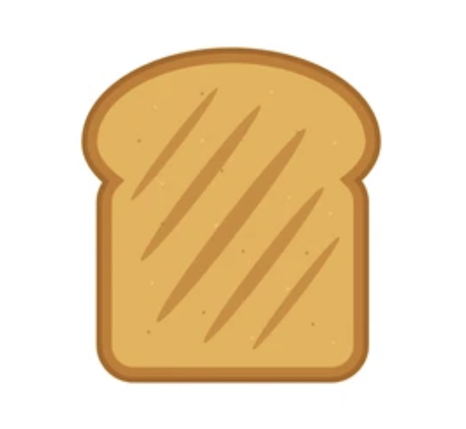

	

	XToast is a library for creating customizable and feature-rich toast notifications in your applications. It allows you to easily display informative messages, alerts, and confirmations to your users in a visually appealing and user-friendly manner.

		
		<!-- 
		 -->
		

## Features

- **Customization**: Customize the appearance, position, and behavior of toast notifications to match your application's design.
- **Types**: Support for various message types, including success, warning, error, and information, with distinct styles and icons.
- **Stacking**: Display multiple toast messages stacked on top of each other for a seamless user experience.
- **Callbacks**: Execute callback functions when users interact with toast notifications (e.g., clicking or dismissing them).
- **Timeouts**: Automatically dismiss messages after a specified duration or allow users to dismiss them manually.
- **Positioning**: Choose from various screen positions for displaying toast notifications.
- **Accessibility**: Ensure that toast notifications adhere to web accessibility standards for all users.

